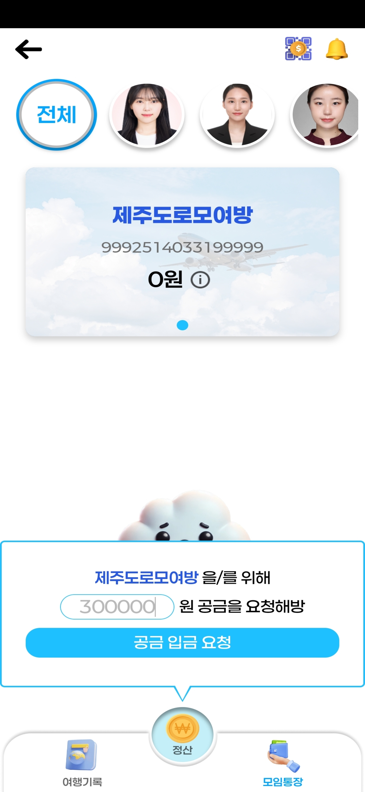
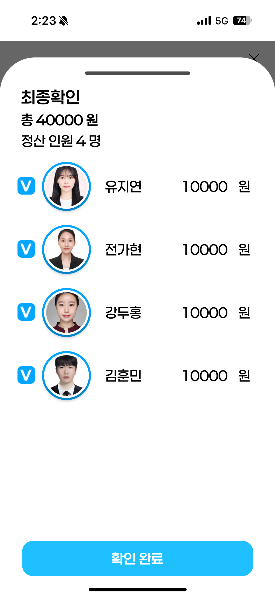
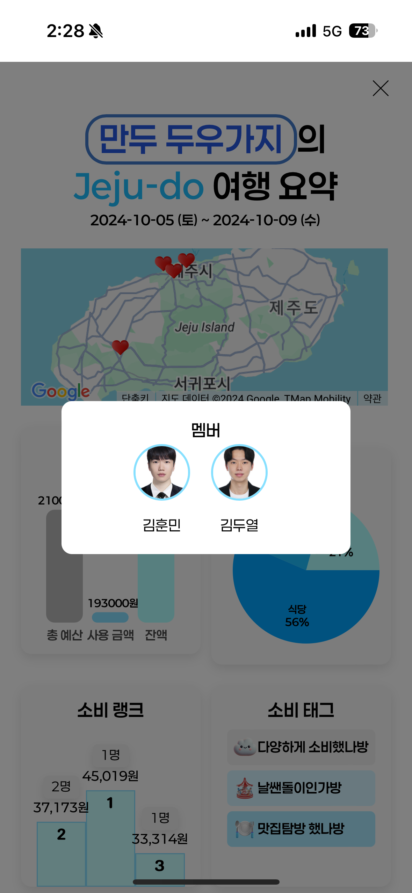

# 여행과 모임 통장을 한방에! - 모여방

  

 

## 프로젝트 정보

### 모여방 / MOYEOBANG
모여방(MOYEOBANG)은 여행 전부터 후까지 재정 관리를 간편하게 해결해주는 올인원 모임통장 서비스입니다.

 

### 개발 기간: 2024년 8월 19일 ~ 2024년 10월 11일

 

## 배포 주소

서비스에 접근하려면 [여기](https://j11c102.p.ssafy.io/)를 클릭하세요

 
 

## 팀 소개

### 백엔드

|                            김두열                             |                             김훈민                             |                              박진우                              |                                                                                                               
|:----------------------------------------------------------:|:-----------------------------------------------------------:|:-------------------------------------------------------------:| 
|  |  |  |
|           [@enduf7686](https://github.com/enduf7686)           |          [@gnsals0904](https://github.com/gnsals0904)           |         [@jjinwo0](https://github.com/jjinwo0)          |

### 프론트엔드

|                             강두홍👑                             |                              유지연                               |                              전가현                              |                                                                                                               
|:-------------------------------------------------------------:|:--------------------------------------------------------------:|:-------------------------------------------------------------:| 
|  |  |  |
|         [@dhkang0912](https://github.com/dhkang0912)          |         [@jiyeoniing](https://github.com/jiyeoniing)         |         [@gahyoenj](https://github.com/gahyoenj)          |

 
 

## 프로젝트 설명

모여방은 여행 중 재정 관리의 불편함을 해결하기 위해 개발된 서비스입니다. 사용자는 여행 전 비용을 쉽게 예측하고, 여행 중 간편하게 결제 및 정산을 할 수 있습니다. 여행 후에는 결제 내역과 통계를 제공하여, 여행의 모든 재정 관리를 한 곳에서 해결할 수 있습니다.
 

## 기능 설명
- 모임 통장과 여행을 한 번에 해결할 수 있도록 사용자가 구글 맵 기반으로 여행 계획을 세울 수 있게 합니다.
- 여행 중 남은 돈은 사용자에게 자동으로 환불되며, 여행 계획 수립 시 예산 예측 기능을 제공합니다.

## 기술 스택

### 프론트 엔드

 
 

 

### 백엔드

 
 
 
 

 

## 사용 Version
### Backend
- Java : Oracle Open JDK 17
- Spring Boot : 3.3.3
- JPA : Hibernate-core-6.5.2
- DB : MySQL, H2, ElasticSearch

### Frontend
- React : 18.3.1
- TypeScript : 5.5.3
- Axios : 1.7.7
- Emotion : 11.13.3
- Tanstack Router : 1.56.1
- React Query : 5.55.0

### 협업 관리 툴

 

 

### 기타

## 화면 구성

### 로그인 진입

  
  

 

### 여행 생성 페이지

  
  
  

  
  
  

  
  
  

  
  

 

### 호텔, 항공, POS 데모

  
  

  

 

### 여행 계좌

  

 

### 여행 보고서

 

### 여행 기록 페이지

 

### 주요 기능 (추가 예정)

---

### 아키텍쳐

 
 

### ERD

